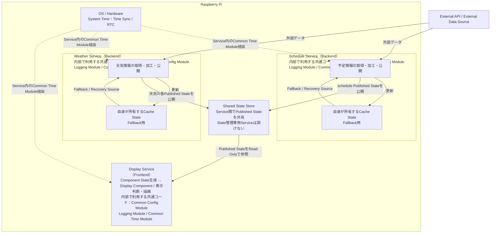
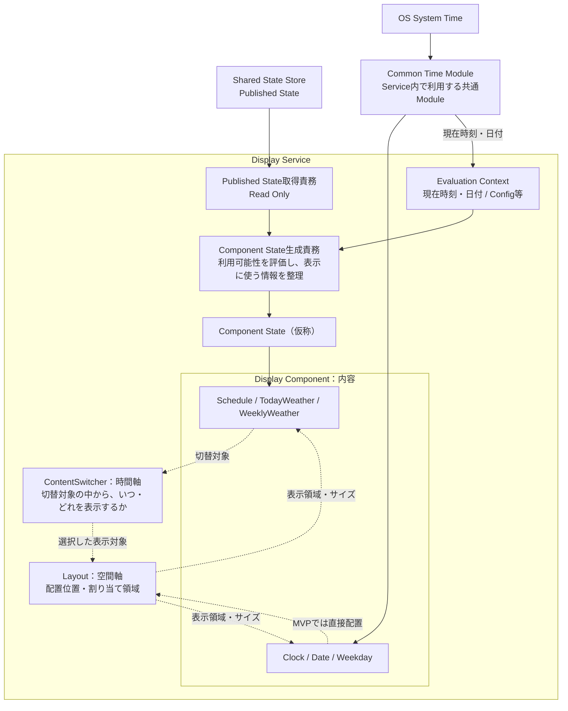
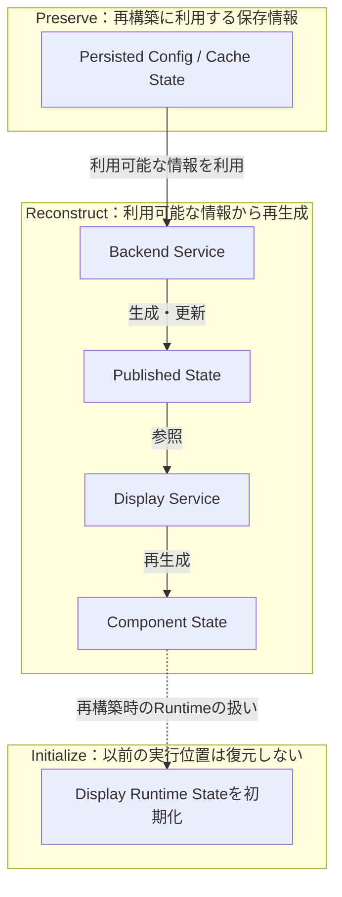
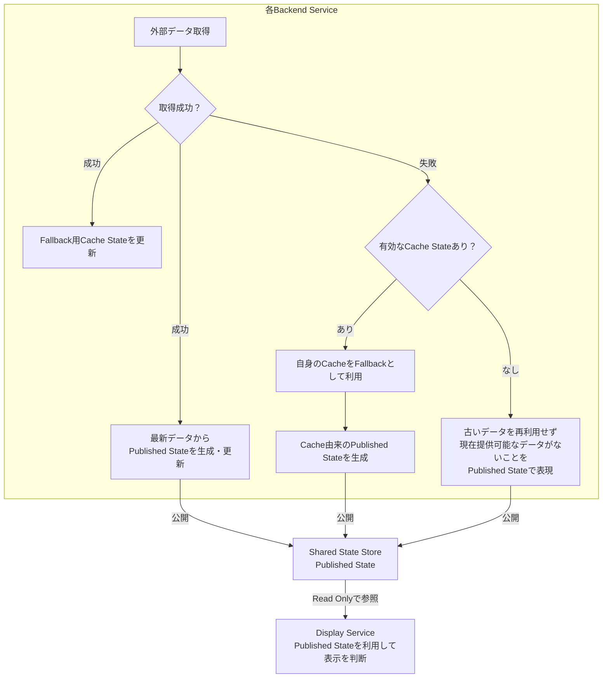

# システムアーキテクチャ

## 1. このドキュメントの目的

Home Digital SignageのMVPを実現するLogical Architectureの正本とする。
Serviceの責務、依存方向、Data Contract、Stateの所有権、起動・復旧・観測の方針を定める。
機能・受け入れ条件は[要件定義](requirements.md)に従う。

Issue #3の確定事項と、具体Technology・詳細実装・UIとして後続Issueへ委ねる事項を区別する。
後続Issueへの申し送りは第15章にまとめる。検討履歴はLearning Logの責務とする。

---

## 2. Architecture Principles / 設計方針

### 2.1 MVPとFuture

MVPではRaspberry Pi上で動作するHome Digital Signageを中心に構築する。

Futureでは、iPadやPC等のWeb管理画面から、
表示内容・配置・サイズ・各種設定などを変更できる構成を想定する。

MVPの段階でCloud/Web管理機能そのものを実装するのではなく、
将来の追加・変更時に既存機能への影響を小さくできるよう、
責務の境界を意識して設計する。

### 2.2 責務と依存の原則

責務分離と独立Service化を区別し、Domainの意味と再利用可能な共通機構を分ける。
StateのOwnershipと一方向の依存を維持し、障害の影響とRecoveryを可能な限り局所化する。
MVPとFutureを分け、将来の可能性だけを理由に不要な機能・共通機構を先行実装しない。
拡張性の境界は第13章、具体Technologyを選定しない項目は第15章に示す。

---

## 3. Logical Architecture Overview

Raspberry Pi上で時計・日付・曜日を表示し、予定や天気のコンテンツを切り替えるサイネージを構成する。
下図をArchitecture全体の地図とし、Display内部は6.5、取得失敗時の分岐は8.7で示す。



実線はデータの流れ、点線は各Service内のCommon Time Moduleを介した時刻利用を表す。Service枠・表示内のModule名は内部で利用する共通コードの注記であり、独立Service / Processを表さない。更新通知方式や起動順序は指定しない。
Cacheは各Backend自身の復旧・再利用用、Shared State Storeは他Serviceへの情報共有用であり、役割を分ける。
DisplayからBackend内部Cacheへの参照経路は持たない。

Common Moduleは共有先のServiceではなく、各Service内で利用する。
DisplayはConfig / Logging、各BackendはCache / Config / Loggingを利用する。
各ServiceはCommon Time Moduleを自身の内部で利用する。図の共通Moduleは独立した実行単位や共通の時刻Serviceを表さない。
OS / HardwareはProcess Management、時刻同期・RTC等の基盤責務を担う。
Process CrashはOS / Service Supervisor、OS HangはWatchdogで復旧する（第11章）。具体方式はIssue #4で決定する。
時刻維持・同期とApplicationからの時刻利用の分担は第10章に示す。
Cacheの意味・有効性は各Backendが所有し、Cache Moduleは保存・読出し等の共通処理を担う。

WeatherのPublished StateはCurrentWeather / HourlyWeather / RainForecast / WeeklyWeatherに分かれる（5.5）。
Display内部の各責務が持つDisplay Runtime Stateについては7.1、永続化・再構築については第7章を参照する。
Shared State Store等の実現技術はIssue #4で決定する。
Display ComponentはShared State Storeを直接参照せず、Published State取得・Component State生成の責務を介する（6.4）。

---

## 4. Service Boundary

### 4.1 Service分割方針

各主要機能についてMSAの考え方を取り入れ、
責務・変更理由・外部依存・障害境界・ライフサイクルを基準に
サービス境界を決定する。

独立ServiceはRaspberry Pi上でそれぞれ独立した実行単位とし、
個別に起動・停止・再起動できる構成を目指す。

ただし、機能が異なることだけを理由にService化せず、
独立した実行単位にするメリットがあるかを判断する。

判断の基本方針は以下とする。

| 分類 | 判断基準 |
|---|---|
| 独立Service | 独立した責務を持ち、独立起動・停止や障害分離に意味がある |
| Service内部Module | 責務は分離したいが、独立実行するメリットが小さい |
| Common Module | 複数Serviceで共通利用したいが、共通障害点にはしたくない |

### 4.2 独立Service

| Service | 主な責務 |
|---|---|
| Display Service | Frontend。Published Stateに基づく表示判断・描画 |
| Schedule Service | Backend。予定情報の取得・加工・管理とPublished Stateの公開 |
| Weather Service | Backend。天気情報の取得・加工・管理とPublished Stateの公開 |

Display / Schedule / Weather は、
責務・変更理由・外部依存・障害原因などが異なるため、
独立Serviceとして扱う。

### 4.3 Common Module

| Module | 主な責務 |
|---|---|
| Cache Module | キャッシュの保存・読出し・削除等の共通処理 |
| Common Config Module | Config取得・保存・更新、Validation・適用状態等のDomain非依存な共通機構（第9章） |
| Logging Module | ログ出力形式・保存等の共通処理 |
| Common Time Module | OSの日時・時刻利用可否、Monotonic Timeによる経過時間、共通Timezoneの利用境界。詳細は第10章 |

Common Moduleは独立プロセスとはせず、
必要なServiceから共通利用する。
Clock / Cache / Config / Loggingを独立Serviceとして追加せず、Service内部責務・Common Moduleとして扱う。

---

## 5. Service Interaction / Data Flow

### 5.1 Frontend / Backendの責務

Display Serviceを表示を担当するFrontendとして扱う。
Schedule Service、Weather Service等を、データ取得・加工を担当するBackendとして扱う。

Backend ServiceはDisplayへ表示命令を出さず、
自身のドメインにおける現在提供可能な情報をPublished Stateとして公開する。
Display ServiceはPublished Stateを利用し、
何を・いつ・どのように表示するかを自身で判断する。
表示対象・切り替えの判断は第6章のDisplay Serviceの責務と整合させる。

### 5.2 Shared State方式とData Flow

MVPのService間連携にはShared State方式を採用する。

| 方式 | MVPでの判断 |
|---|---|
| 直接連携 | 採用しない |
| Pub-Sub | MVPの中心となる連携方式には採用しない。Futureの更新通知として検討可能 |
| 共有State | 採用。BackendがShared State Storeへ公開し、Displayが必要なPublished Stateを参照する |

概念的なデータフローは以下とする。

```text
External API
→ Backend Service
→ Published State
→ Shared State Store
→ Display Service
→ Component State生成・Component State
→ Display Component / Renderer
```

Shared State StoreはService間で現在状態を共有するための保存先として扱う。
State管理専用Serviceは追加しない。
下流側から上流側のStateを書き換えず、Display ComponentもPublished Stateを直接変更しない。
具体的な実現技術はIssue #4で選定する。HTTP、DB、ファイル、MQTT等は本書では確定しない。

### 5.3 採用理由と設計上の注意点

Shared State方式は、以下の目的で採用する。

- FutureのNews、Stock等のBackend追加時にも、Displayと各Backendの直接依存を増やさない。
- Backend停止時も、最後の有効なPublished Stateを利用できる。
- Display再起動時にPublished Stateから表示に必要なStateを再構築できる。表示位置の復元とは区別する。
- State管理専用Serviceを追加せず、独立Serviceの共通障害点を増やさない。

設計上は、以下の点を考慮する。

- Shared State Store自体は共通依存となる。障害を各Serviceの停止へ直結させない（5.6）。
- Schemaを介したProducer / Consumerの密結合に注意し、Published StateのSchema変更を管理する。
- State Ownershipを明確にし、各Serviceの書込み責任を維持する（5.4）。
- Concurrent Accessを考慮する。
- CacheとShared Stateの責務を分離する。
- MVPだけを考えれば、直接連携より構成が複雑になる。

News、Stock、Photo等の追加はFutureであり、MVPの実装対象には含めない。

### 5.4 Stateの所有権とデータ契約

Shared State Storeを利用しても、Stateの所有権は各Serviceに持たせる。

| Service | Published Stateへの関与 |
|---|---|
| Weather Service | 天気の各Published Stateの所有者・Writer |
| Schedule Service | schedule Stateの所有者・Writer |
| Display Service | Published StateをRead Onlyで利用する |
| Futureで追加するBackend Service | 自身のPublished Stateを所有・公開する |

各Backend Serviceは他Serviceが所有するStateを書き換えない。
Backend Service内部のデータ構造とPublished Stateを分離し、
Published StateをService間のデータ契約として扱う。
複数Published State間の厳密なtransaction / snapshot consistencyをMVPでは要求しない（7.9）。

### 5.5 Published Stateの情報単位と有効期限

Published StateはService単位や外部APIレスポンス単位ではなく、
「鮮度・有効期限・障害状態を独立して管理する意味がある情報単位」で分割する。

Weather Serviceでは概念的に以下を持ち、それぞれ独立して鮮度・有効期限・状態を管理できる。

- CurrentWeather
- HourlyWeather
- RainForecast
- WeeklyWeather

Schedule Serviceなど独立管理する必要がない場合は無理に細分化しない。
細かくすること自体が目的ではなく、時間的・状態的に独立管理する意味がある単位で分ける。
Service境界、Published State境界、Display Component境界は一致する必要がない。
これらは概念上の情報単位であり、具体的なクラス名やAPIを確定するものではない。

Published Stateには表示データに加え、
提供元Serviceが停止していてもDisplay側で利用可能性を判断できるメタデータを含める。

データ本体と、利用可能性・鮮度・取得結果等の判断材料を提供する。
異なる意味の時刻を単一のupdatedAtへまとめず、必要なmetadataを区別する（7.8）。
具体Schemaやstatusの値はIssue #4・詳細設計で決定する。

データの有効期限そのものは、
そのデータの意味を理解しているBackend Serviceが決定する。
DisplayはWeatherやSchedule固有のTTLを持たず、
Published StateのexpiresAt等を基に、各Published Stateが利用可能かを判断する。
その上で、Componentとして何を表示できるかは、Display Service内部のComponent State生成責務で整理する。

情報単位の分割方針と、具体的なSchema・各メタデータの厳密な意味や粒度は区別する。
後者とSchema変更管理はIssue #4・詳細設計で具体化する。
情報種別ごとの鮮度・期限切れ・部分取得失敗の扱いは、
[要件定義](requirements.md)のR-04/R-07を満たすものとする。
取得周期・TTLの数値は同文書の暫定値を維持し、Issue #4で再評価する。

### 5.6 障害時の動作

Shared State Storeの障害を各Service自身の停止理由にはしない。
Storeへアクセスできない場合も、可能な範囲で以下を継続する。

- Backend Serviceは外部データ取得と自身のCache管理を継続する
- Display Serviceは保持済みの有効なComponent Stateで表示を継続する
- 一部Stateが利用不能でも、他の正常なコンテンツは表示を継続する

Backend Service停止時も、
Shared State Storeに残るPublished Stateが有効期限内であればDisplayは利用できる。
Display Service再起動時は現在のPublished Stateを参照し、
有効な情報からComponent Stateを再生成できる構成とする。
システム再起動後のState再生成・初期化は第7章、起動・復旧の制御は第11章に示す。

期限切れStateは表示に利用しない。
保持済みのComponent Stateによる一時的な継続でも、この原則を変えない。

表示の継続は[要件定義](requirements.md)のR-04/R-06/R-07に従う。
正常取得時は不要な異常状態の注記や最終更新日時を表示しない。
Backend ServiceがCacheを利用してPublished Stateを生成した場合も、
Display ServiceはBackend内部のCacheを直接認識・参照せず、Published Stateを利用する。
取得異常であること、および必要な最終更新日時等を、
DisplayがPublished State経由で識別・表示できる構成とする。
具体的なPublished State Schemaやstatusの値・粒度はIssue #4・詳細設計で決定する。
期限切れ・利用可能なデータがない場合は、その情報を表示に利用しない。
外部データの取得失敗はこれとは別の事実として扱い、
必要に応じてPublished Stateを通じてConsumerへ伝達する。
複合コンテンツの一部情報が利用できない場合も、正常・有効な情報は表示を継続する。
外部情報の取得・利用可否によって基本画面の起動や正常な別コンテンツの表示を妨げない。

Store障害・Service停止を含む具体的な状態判定、再アクセス・再公開・復旧の手順はIssue #4・詳細設計で具体化する。

### 5.7 Futureの更新通知

MVPではShared Stateを中心とする。
Futureでリアルタイム更新通知が必要になった場合は、
Shared StateとPub-Sub等の更新通知を組み合わせる構成を検討できる。

- Shared State：現在どうなっているか
- Event：何が起きたか

具体的な通知方式はFutureの設計で決定する。

---

## 6. Display Architecture

### 6.1 時計表示

Clock Serviceは設けない。

時刻を必要とする各ServiceはCommon Time Moduleを介してOS System Timeを利用する（第10章）。
時計・日付・曜日の描画はDisplay Serviceの責務とする。

Clock Serviceを共通の依存先にすると、
Clock Serviceの障害が他Serviceへ波及する可能性があるため、
不要なService間依存を作らない。

Futureでは時計を含む表示要素の位置・サイズ等を
利用者がカスタマイズできることを想定する。

具体的なUI構造はIssue #5および実装設計で決定する。

### 6.2 Content Switching

Content Switchingは独立Serviceにせず、
Display Service内部の独立した責務として持つ。

ContentSwitcherは主に以下を担当する。

- 切替対象内で表示するコンテンツの決定
- 表示順序の管理
- 表示時間の管理
- 次に表示するコンテンツの決定
- 表示可能なコンテンツの切替対象としての扱い

独立ServiceとするとDisplayとの通信・依存関係が増え、
Content Switching Service障害時の処理も新たに必要となる。

Futureの表示順序・ON/OFF・表示時間変更は、Display内部の責務境界を利用して拡張する。

将来必要になった場合に切り出せるよう、
描画処理とは責務を分離する。

### 6.3 Display Component / Layout / ContentSwitcher

Display Service内部では、以下の責務を分離する。

| 責務 | 担当すること |
|---|---|
| Display Component | 内容。「何を、どう表示するか」 |
| ContentSwitcher | 時間軸。「切替対象の中から、いつ・どれを表示するか」 |
| Layout | 空間軸。「どこに、どの大きさで表示するか」 |

LayoutはComponentへ表示領域・サイズを割り当て、Componentはその領域内の情報量・内部UIを含む表示を担当する。
Futureで利用者によるサイズ変更が必要になった場合も、この責務境界を利用する。
具体的なResponsive方式・サイズ区分・専用Mechanismを、Future対応のためだけにMVPで先行実装する要求ではない。
具体方式は必要となる後続設計で決定する。

LayoutはComponentの配置位置と割り当て領域を管理し、
WeatherやScheduleなどのドメイン固有の表示判断は持たない。

MVPのContentSwitcherはSchedule、TodayWeather、WeeklyWeatherを切替対象とし、
切替順序、表示時間、現在の切替位置などを扱う。
Clock / Date / Weekdayなどの常時表示Componentは、
ContentSwitcherを経由せず直接Layoutへ配置する。

ただし、常時表示か切替表示かは画面構成上の扱いとし、
「Clockは常時表示Componentである」という性質をComponent自体には持たせない。
Futureで同じComponentを別の画面構成でも利用できる余地を残す。

### 6.4 Published State取得とComponent State生成

Display Component自身はShared State Storeを直接参照しない。
Display Service内部にPublished Stateを取得する共通責務を設け、
取得したStateをDisplay内部へ渡す。
これにより、Storeの実装・取得方式が変わった場合のComponentへの影響を抑える。

さらに、Published StateをそのままComponentへ渡して状態解釈をすべて任せるのではなく、
Componentが表示に利用するStateを生成する責務を分離する。

例えばTodayWeatherではCurrentWeather、HourlyWeather、RainForecastなど、
複数のPublished StateからComponent Stateを生成できる。

- Backend Service：他Serviceへどの情報を提供するか
- Component State生成責務：その情報からComponentが何を表示できるか
- Display Component：渡された表示情報をどう描画するか

Component Stateは論理上の名称として扱い、正式名称・具体構造は詳細設計で決定する。
意味変化ベースの再評価と部分障害時の状態表現は第7章に示す。
具体的なクラス名、取得方式、Component StateのSchemaや表示可否interfaceは後続設計で決定する。

### 6.5 Display Service内部構造図

データを表示内容へ整理する流れと、時間軸・空間軸の責務を示す。
実線は情報の流れ、点線は表示対象の選択・配置の関係を表す。呼出し順序や具体的な実装構造は表さない。



必要な情報と部分欠落時の扱い、再評価の責務・契機は第7章に従う。
時計等の基本画面はBackendや外部APIを待たずに表示する。
常時表示・切替表示の区分は6.3の画面構成上の扱いを表す。
Common Time Moduleは独立Serviceではなく、Display内で利用する共通境界を示す。
この図はClock / Date / WeekdayにComponent Stateの生成・経由を必須とするものではない。

---

## 7. State Management

Ownership、実行中の保持先、永続化、Recovery時の扱いを区別する。

### 7.1 Stateの分類と所有権

Stateを以下の4種類として扱う。Component State / Display Runtime Stateは論理上の名称とし、正式名称と具体構造は詳細設計で決定する。

| State | 所有者 | 目的 | 生成・更新 | 実行中の保持先 |
|---|---|---|---|---|
| Cache State | 各Backend Service | 外部API等の取得失敗時のデータ再利用とBackend自身の復旧・継続動作 | 各Backend Service | 各Backend Service配下のCache |
| Published State | 各Backend Service | 他Serviceへ現在提供可能な情報を公開するService間データ契約 | 各Backend Service | Shared State Store |
| Component State（仮称） | Display Service | Published State等をComponentが描画に利用しやすい状態へ整理 | Display内部のComponent State生成責務 | Display Service内部 |
| Display Runtime State（仮称） | Display Service内部の各責務 | Display自身の現在の動作状態 | 原則としてそのStateを必要とする責務 | Display Service内部の各責務 |

Cache Moduleは保存・読込等の共通機構を提供し、
Cache Stateそのものの所有者にはならない。Cacheの管理責任は第8章に従う。

Service間のRead / Write境界は5.4に従う。
BackendがCacheを利用した場合もPublished State経由で情報を提供し、Displayが内部Cacheを直接参照することはない。

Component StateはShared State Storeへ戻さず、Backendからも参照しない。
Display Runtime Stateはcurrent component / current switch index / next switch timeなどを指し、
一つの巨大なRuntime State Managerへ集約しない。

### 7.2 永続化の基本方針

すべてのStateを永続化するのではなく、
「再生成できない、または再生成するために必要なStateを永続化する」ことを基本とする。

| State | 再起動を跨ぐ保持方針 |
|---|---|
| Cache State | 再起動後の早期復旧・外部取得失敗に備えて保持する。有効なCacheからBackendがPublished Stateを再生成できる |
| Published State | 実行中はShared State Storeに保持する。システム再起動を跨ぐ永続化はMVPでは必須としない。起動時は8.2の方針に従い、有効なRecovery Sourceによる再生成と速やかな外部取得による最新化を行う |
| Component State | 永続化しない。必要に応じてPublished State等から再生成可能な派生Stateとして扱う |
| Display Runtime State | 原則として永続化しない。MVPではContentSwitcher等を初期状態から開始してよく、再起動直前の表示位置の復元は要求しない |

Backend Service単体が停止した場合は、Shared State Storeに最後にPublishされたStateを残せる構造とする。
Displayは有効期限内のStateを利用できる。
これはシステム再起動を跨ぐPublished Stateの永続化を必須としない方針とは区別する。

switch order、display duration、将来の利用者指定Layoutなど、
「現在どう動いているか」ではなく「どう動くべきか」を表す情報はRuntime StateではなくConfigとして扱う。
必要なConfigは永続化し、MVPの保存済み設定は再起動後も保持する。
利用者指定Layoutの機能自体はFutureのままとする。
Desired / Persisted / Actual Configurationは、適用したい設定・永続化済み設定・Runtime適用済み設定を区別する（9.4）。
ActualはConfigのRuntime適用状態であり、Display Runtime Stateを集約する新しいManagerではない。

Recovery時の扱いを以下に分類する。7.1のState分類・所有権とは別に、復旧時に何を行うかを示す。

| Recovery時の扱い | 対象・方針 |
|---|---|
| Preserve | 再生成できない情報、またはRecovery時の再取得を保証できず再生成に必要な情報。User / System Config、Secrets、Last Known Valid Config、Backend CacheとCache Metadata |
| Reconstruct | 信頼可能なStateから再生成できるDerived State。BackendがConfig / Cache / External API等からPublished Stateを、DisplayがUsableなPublished State等からComponent Stateを再生成する |
| Initialize | Crash前の復元を要求せず初期化するRuntime State。Display Runtime State、ContentSwitcherの現在位置・残り表示時間、Retry Timer、Timeout、Backend内部Runtime State |

現在時刻はApplicationが復元せず、Common Time Moduleを介してOS System Timeを利用する。
保存情報は無条件に信用せず、Config / Cache / Published State等のUsabilityを再評価してから使う。
新しいPublished Stateが残る場合のFreshness退行防止は11.4に従う。

### 7.3 再起動時の基本的な再構築

以下は必要最小限の永続Stateを利用した再構築の概念を示す。
Backend起動時は8.2に従い、有効なRecovery Sourceによる再構築を外部取得完了まで不要に待たせず、最新情報の取得も速やかに開始する。
図中のCacheはFallback / Recovery Sourceであり、Published State生成の必須経路ではない。
再起動前の派生Stateをすべて復元する方針ではない。



実線はState再構築に使う情報の関係、点線はRuntime Stateを初期化する扱いを示す。
矢印はStartup Sequenceや処理の実行順序・待合せを指定しない。

この図はState Reconstructionの概念図であり、以下を意味しない。

- DisplayがBackend起動完了を待つこと
- Application Serviceが特定順序で起動すること
- External Acquisition完了後でなければCacheを利用できないこと
- Config / Cache / Published Stateの存在がService起動成功の必須条件になること

[要件定義](requirements.md)のR-01/R-06に従い、基本画面は外部情報取得を待たずに起動し、
時刻が利用不能な場合はR-01の未同期状態を表示する。ネットワーク未接続と時刻利用可否の区別は10.2に従い、外部情報が利用できない場合の表示はR-07に従う。
具体的な起動・再構築のタイミングや同期方式は後続設計で決定する。

### 7.4 Component Stateの再評価

MVPでは固定周期を基本とせず、
Component Stateの表示上の意味に影響する変化を契機に必要なStateを再評価する
「意味変化ベース」を採用する。

概念的な再評価契機：

- Published Stateの更新
- expiresAt到達など、時間経過によるPublished Stateの利用可能性変化
- Config変更
- 現在時刻・日付の変化によるComponent上の意味変化
  - Scheduleの「現在の予定 / 次の予定」の切り替わり
  - 日付変更など

MVPでは更新契機の取りこぼしに対する周期的な再評価を必須としない。
周期再評価をArchitecture上禁止するものではなく、
Futureで自己回復性が必要になった場合には追加可能とする。
時間による意味変化をtimer / scheduler / polling等でどう検出・起動するかはIssue #4で決定する。

### 7.5 再評価の責務分担

Display内部で「共通的な変化の検出」と
「Component固有の再評価判断・Component State生成」を分離する。
共通責務はComponent固有の表示ロジックを持たない。

各Component State生成責務が、自身に必要なPublished State、
Current Time / Date、Config等を基に、
再評価要否と生成するComponent Stateを判断する。
Common Time Moduleが「Scheduleを更新する」といったComponent固有知識を持つ構造にはしない。
現在時刻・日付は同Moduleを介して利用し、日時と経過時間の使い分けは10.4に従う。

具体的な変更検出・通知・スケジューリング方式は技術選定・詳細設計で決定する。

### 7.6 Published Stateの利用可能性

Backendはデータ本体と、利用可能性の判断に必要なmetadataを提供する。
DisplayはPublished Stateと現在のEvaluation Contextを基に、利用時点で利用可能性を判断する。

Backend内部のCache実装やRetry状況など、内部処理の事情にDisplayを依存させない。
第8章に従い提供するCache由来・必要な取得失敗の事実は、Published Stateを介してConsumerへ伝達する。
例えばBackendがAPI取得に失敗しても、有効なCacheから利用可能なPublished Stateを生成できれば、
DisplayはそのPublished Stateを利用可能な情報として扱える。
利用可能であることと、最新取得データではないことの表示は分けて扱う。

Shared State Store上に存在することと、現在利用可能であることは別概念とする。
期限到達時にStoreから必ず削除することは要求せず、
Displayが利用時点で利用可能性を評価する。

更新状態・最終更新日時の表示は5.6およびR-07に従う。
具体的なデータ契約・SchemaはIssue #4・詳細設計、UI表現はIssue #5で決定する。

### 7.7 部分障害時のComponent State

一部のPublished Stateが利用不可でも、
利用可能なPublished Stateから可能な範囲でComponent Stateを生成する。
すべてのPublished Stateが揃うことを成立の共通条件にはしない。

各Component State生成責務が以下を判断する。

- どの情報があればComponent Stateを成立させられるか
- 一部情報が欠落した場合に何をComponent Stateへ含めるか

MVPではFull / Partial / Unavailableのような共通状態enumを
Component Stateに明示的には保持しない。
含まれる利用可能な情報そのもので状態を表現する。

TodayWeather Component Stateの概念例：

```text
currentWeather = data
hourlyWeather = data
rainForecast = null
```

これは一部情報が利用できない状態の例であり、具体的なSchema・型を確定するものではない。
Component Stateを成立させられない場合の具体的UI
（非表示、エラー表示、代替表示等）はIssue #5で決定する。
R-04/R-07の正常情報の継続表示・取得失敗状態の伝達は維持する。

### 7.8 Stateの論理Schema原則

すべてのStateに同一Schemaを強制せず、各責務に必要な情報のみ保持する。

| State | 保持する情報 |
|---|---|
| Cache State | Backendが再利用・復旧するために必要な情報 |
| Published State | 他Serviceが利用するデータ本体と、利用可能性・鮮度・更新等の判断に必要なmetadata |
| Component State | Display Componentの描画に必要な情報。Published Stateのmetadataを無条件にコピーせず、UIとして必要な場合のみ含める |
| Display Runtime State | Display内部の各責務が現在の動作を継続するために必要な情報 |

Published Stateの時刻metadataは、
意味の異なる情報を曖昧な単一のupdatedAt等へ統合しない。
必要に応じ、例えば以下の意味を区別する。

| 概念例 | 意味 |
|---|---|
| dataTimestamp | データ自体が基準とする時刻 |
| publishedAt | Published Stateを生成／公開した時刻 |
| expiresAt | 利用可能期限 |

すべてを全Published Stateの必須項目とはせず、各Stateに必要なmetadataのみ保持する。
具体的なSchema・型・serialization形式・必須／Optionalは詳細設計で決定する。

### 7.9 Published State間の整合性

MVPでは複数Published State間の厳密な時点整合性・transactional consistencyを要求しない。
それぞれ独立した情報単位として扱い、
Component State生成時には各Published Stateを個別に利用可能性評価し、
その時点で利用可能なものを使用する。

TodayWeatherのCurrentWeather / HourlyWeather / RainForecastについても、
dataTimestampや更新タイミングが完全に一致することは要求しない。
複数Published Stateのatomicな取得・更新もMVP要件とはしない。

State間の整合性を要求しないことは、
個々のPublished Stateの利用可能性確認を省略することではない。

---

## 8. Cache

### 8.1 位置付けと責務

Cacheは独立Serviceにしない。
Cache Stateは、外部データを取得できない場合のFallbackやStartup / Recovery時のRecovery Sourceとなる補助データとし、
各Backend Serviceがその意味・有効性と管理責任を持つ。

| 担当 | 責務 |
|---|---|
| 各Backend Service | 何をCacheするか、有効期限、Fallbackの可否、期限切れ・無効なCacheの扱い |
| Cache Module | ドメインに依存しない保存・読出し・更新・削除、指定された有効期限に基づく期限判定 |

保存処理を共通化しながら、Cache Serviceという共通障害点を作らない。
Stateの所有権・永続化は第7章に従う。
Display ServiceはBackend内部のCacheを直接参照しない。

### 8.2 正常時と起動時の取得方針

正常時は外部APIから取得したデータをBackend Serviceが利用し、
Published Stateを生成・更新すると同時に、Fallback用のCache Stateを更新する。
Cache保存後の再読出しを経由しなければPublishできない構成にはしない。

Normal OperationではExternal Data SourceをSource of Truthとして最新情報を取得する。
CacheはFallback / Recovery Sourceであり、Normal OperationのSource of Truthにはしない。
Startup / Recoveryでは、Valid Cache等によるState ReconstructionをExternal Acquisitionの完了まで不要に待たせない。
利用可能なRecovery Sourceから早期復旧するとともに、External Acquisitionも速やかに開始し、成功後に最新Stateへ自動収束する。
Cache-first / API-firstという厳密な実装順序や具体的な並列処理方式は固定しない。
具体的なConcurrency・非同期処理・Task管理はIssue #4 / 詳細設計で決定する。復旧後の収束は11.6に示す。
Displayの基本画面起動はBackendや外部APIを待たない既存方針を維持する。
timeout、retry回数・間隔は後続設計で決定する。

### 8.3 有効期限と削除

有効期限は一律に定めず、情報の性質、外部ソースの更新特性、
取得頻度・制約を理解しているBackend Serviceが決定する。
具体的な期間はAPIや取得周期等の決定後に設定する。

MVPではデータ鮮度の有効期間とCacheをFallbackとして利用可能な期間を、
同一の有効期限として扱う。
期限切れCacheはFallbackに利用せず、削除対象とする。
期限到達時の即時物理削除は要求せず、
次回の外部取得成功やCache更新等、適切なタイミングで置換・削除できればよい。

CacheからPublished Stateを生成しても、元データの鮮度期限は延長しない。
Fallback利用時刻を起点として有効期限を再設定しない。

例えば10:00にAPI取得し有効期限が12:00のCacheを、
11:50の取得失敗時に再利用してPublishした場合も、Published Stateは12:00までとし、
12:00以降は利用しない。この例はTTLの採用値を定めるものではない。
Cache再利用・再Publishによって古いデータを延命しない。

### 8.4 情報単位ごとのFallback

FallbackはBackend全体ではなく、
独立して鮮度・有効性を管理する意味のある情報単位ごとに判断する。
WeatherではCurrentWeather / HourlyWeather / RainForecast / WeeklyWeather等を独立して扱える。

一部情報の取得失敗によって、正常に取得できた他の情報までFallbackさせない。
外部APIの物理的なリクエスト単位とCache State / Published Stateの論理単位の一致は要求しない。
Published State間の厳密なsnapshot整合性を要求しない第7章の方針は維持する。

### 8.5 取得・Cache異常時

| 状況 | Backendの扱い |
|---|---|
| 外部取得失敗、有効Cacheあり | 対象情報のCacheをFallbackとして利用する。元データの鮮度期限を維持する |
| 外部取得失敗、有効Cacheなし | 過去データを利用可能な情報として再利用せず、現在提供可能なデータがないことをPublished Stateで表現できるようにする |
| API取得成功、Cache更新失敗 | 最新データからPublished Stateを更新する。Cache更新失敗で公開を妨げず、将来のFallback能力が低下した状態として扱う |
| Cacheの破損・読出し不可・必要情報の不足等 | 正常なFallbackデータとして使用せず、無効なCacheとして削除対象にする |

必要に応じて、最新の外部データ取得が失敗した事実をConsumerが認識できる情報を提供する。
BackendはDisplay固有の表示可否・エラー表現を決めず、
DisplayがPublished StateとEvaluation Contextから利用可否・表示表現を判断する。
Componentとしての表示判断の責務分離は第6・7章に従う。

### 8.6 Cache由来情報の伝達

CacheをFallbackとしてPublished Stateを生成した場合、
ConsumerがそのデータをCache由来と識別できるようにする。
Displayが最新取得データではないことを画面上で表現できるようにするため。

BackendはCache由来という事実を提供するだけとし、
警告・アイコン等のDisplay固有の表現方法は決定しない。
Displayは内部Cacheの実装や直接参照に依存せず、Published State経由で事実を受け取る。

source = cache等のSchema、status・エラー分類、具体的なUIは後続設計で決定する。
Cache保存技術・形式・破損検出・atomic write等もIssue #4で選定する。

### 8.7 Cache / Fallbackの基本フロー

以下は外部データ取得結果に対する基本分岐を、独立して鮮度・有効性を管理する情報単位ごとに示す。
Startup / Recovery全体の処理順序を示す図ではなく、Valid Cacheの早期利用は8.2に従い外部取得の完了を不要に待たせない。
正常取得時のPublished State生成とCache更新は別の経路とし、Cache保存・再読出しを公開の前提にしない。



Cacheから生成・再公開しても、元データの鮮度期限は延長しない。
DisplayはBackend内部Cacheを直接参照せず、Published Stateを通じてCache由来等の事実を受け取る。
Cache更新失敗・破損等の扱いは8.5に従う。

---

## 9. Config / Secrets

Configuration Informationの分類、所有権、変更・復旧、Secretsの扱いを論理設計として整理する。
Common Config Module / Configuration Boundaryを共通の利用境界とし、
独立したConfig Service / Secret Serviceプロセスの新設は要求しない。
MVPではローカルに保持された設定を利用し、保存済み設定を再起動後も維持する。

### 9.1 Configuration Informationの分類

| 分類 | 意味 | 例・候補 |
|---|---|---|
| User Config | 一般利用者が変更可能な設定 | Weather対象地域、Schedule対象Calendar、ContentSwitcherの表示順・各Contentの表示時間、将来のComponent ON/OFF・Layout・Componentサイズ |
| System Config | システム管理者が管理・変更する、秘匿性を必要としない設定 | Weather / Schedule取得間隔、Cache TTL、API Timeout、Retry回数・間隔、Log Level・保持期間 |
| Secrets | 漏洩が不正アクセス・なりすまし・権限悪用等につながるため秘匿性を必要とする情報 | 秘匿性が必要なAPI Key、Access Token、Refresh Token、Password、Client Secret、Private Key |

「誰が変更可能か」と「秘匿性が必要か」は別の分類軸として扱う。
System Configの候補すべてを外部Config化する要求ではなく、
実際の外部化は運用上の必要性・技術選定に応じて判断する。
R-08で必要とされた設定の保持方針は維持する。
Application Timezoneは第10章のArchitecture / SpecificationとしてAsia/Tokyo固定であり、User Configには含めない。

この分類はMVPで全設定を利用者が変更できることを意味しない。
R-04 / R-08に従い、MVPでは専用設定UI・Web管理画面を作らず、開発者が設定を変更できればよい。
切替順・表示時間の利用者変更、表示内容・配置のカスタマイズはFutureのままとする。

### 9.2 Ownershipと共通境界

Configの意味・妥当性・利用方法・変更時の振る舞いは、
原則としてそのConfigを利用する責務を持つ各Serviceが所有する。
Weather ServiceはLocationの意味・固有Validation・変更時の振る舞い、
Schedule ServiceはCalendar設定の意味・固有Validation・変更時の振る舞いを所有する。

責務分離と実装重複を混同せず、各ServiceがConfig管理基盤を個別実装することは避ける。
Common Config Module / Configuration Boundaryでは、Domain非依存で再利用可能な以下の機構を共通化できる構造とする。

- Config取得・保存・更新経路
- 共通的な変更通知・Validation機構
- Schema / Version / Migrationを扱う共通機構
- Configの適用状態等を扱う共通的な管理機構

Common Config ModuleはweatherLocation / scheduleCalendar等のDomain固有の意味を所有しない。

設定はまず特定Serviceの責務に属するかを判断する。
特定Serviceに属さずシステム全体として意味を持つ設定は、将来の拡張点としてSystem-wide Configを許容する。
複数Serviceから参照されることだけを理由にSystem-wide Configへ分類しない。
Common Config ModuleがそのDomain上の意味を所有するわけでもない。
MVPで該当設定がなければ、具体的なSystem-wide Config管理機構は実装不要とする。

### 9.3 Config供給とRuntime変更

各Serviceは起動時に必要なConfigを取得し、初期動作へ適用する。
ServiceはLocal File / Web / Cloud等の具体的なConfig Sourceへ直接依存せず、
変更元もServiceへ直接依存させず、Configuration Boundaryを介する。

概念上の供給経路は以下とする。

MVP：Local Config → Configuration Boundary → 各Service

Future：Local Settings UI / Web Management / Cloud Management → Configuration Boundary → 各Service

ArchitectureとしてRuntime変更を許容し、特にUser Configでは、
将来のSettings UI・Web管理・Layout customizationから不要なService再起動なしで反映できる構造を目指す。
適用方法は一律にせず、設定の性質に応じてImmediate Apply、Commit後Apply、
Next OperationでApply、Restart Required、Preview → Commitを許容する。

User Configでは操作性・即応性、System Configでは整合性、Secretsでは安全性を重視する。
Layout等の連続操作ではRuntime Previewを即時反映し、操作完了時にPersistする方式も許容する。
これらは管理UIをMVPへ追加する要求ではない。
具体的な通知・適用・通信方式は第15章へ引き継ぐ。

### 9.4 Persist / ApplyとDesired / Persisted / Actual Configuration

| 概念 | 意味 |
|---|---|
| Desired Configuration | 最終的にシステムへ適用したい設定 |
| Persisted Configuration | 永続化に成功しており、再起動後も復元可能な設定 |
| Applied / Actual Configuration | 現在Runtimeで実際に使用されている設定 |

通常の安定状態ではDesired = Persisted = Actualとなるが、変更処理中や障害時には一時的な不一致を許容する。
Apply / Persistの順序はArchitecture全体で固定しない。
Restart Required等では次回起動まで意図的に不一致となり得るため、Desired != Actualを必ずしも異常と扱わない。

Persist成功後にApplyが失敗しても、可能であれば最後に正常適用されたActualで動作を継続する。
例えば、変更前の各設定が10秒の場合、以下の状態が成立する。

| 状況 | Desired | Persisted | Actual |
|---|---|---|---|
| Apply先行・Persist処理中 | 30秒 | 10秒 | 30秒 |
| Persist成功・Apply失敗 | 30秒 | 30秒 | 10秒 |

後者ではApply失敗のみを理由に停止せず、10秒での正常動作を継続する。
Desiredを失わず自動Retryで再Applyを試み、成功時にはPersist済みのDesiredとActualが一致する。最終的には各状態が正常な設定へ収束する。
不一致が継続する場合は、その状態を利用者・管理者が認識できるようにする。

将来の管理UIでは、Desiredの再Applyや、Desiredを現在のActualへ戻す操作を可能にできる。
Actualが残っていることとConfig History / Undoは別概念とし、多世代履歴はMVP要件にしない。
ActualはConfigのRuntime適用状態であり、第7章の「どう動くべきか」と「現在どう動いているか」の区別を崩さない。
巨大なRuntime State Managerを新設したり、既存のState分類・所有権を変更したりする意図はない。

### 9.5 Validation・外部処理・Config Recovery

ConfigとしてValidであることと、そのConfigを利用した外部処理が成功することは分ける。
例えばWeather LocationをNagoyaからTokyoへ変更し、TokyoがValidation上Validなら、
一時的なWeather API通信失敗を理由にNagoyaへRollbackしない。
Validation失敗はConfig FailureとしてRecoveryし、Valid Configでの外部処理失敗は
Backend / External Operation Failureとして第8章のCache等によるFallbackで扱う。

Last Known Valid Configurationは、
「現在Configが欠落・破損・Validation失敗した場合に、Config Recoveryとして利用可能な直近のValid Configuration」
を意味する。外部API等での処理成功実績を意味せず、API障害によってValid Config自体をInvalidとはしない。

Config障害時も可能な限りシステム全体の動作を継続する。
Safe Config Fallback / Default、Last Known Valid Configuration、
有効な既存データによる限定的継続を利用可能とし、
それらでも継続できない場合のみ影響する機能をUnavailableとする。
Weather Configの障害はWeatherへ、Schedule Configの障害はScheduleへ局所化し、
他のServiceやClock / Date等へ波及させない。
Required / Optionalは、システム全体ではなく対象機能の意味を成立させるために必要かで判断する。

### 9.6 Config FallbackとData Fallback

| 種別 | 補うもの | 例 |
|---|---|---|
| Config Fallback | 新しい外部データ取得に必要な設定 | Safe DefaultやLast Known ValidのCalendar設定で、新しいSchedule取得先を特定する |
| Data Fallback | 外部データそのもの | Schedule Cacheでは新しい取得先は特定できないが、期限内の既存Scheduleを利用できる |

Config Fallbackによって既存データのValidity / Freshnessを不当に延長しない。
Cache TTL等のFallbackによって、既に期限切れのCacheを再びValidとして扱わない。
既存データの利用は第5・7・8・11章に従い、DisplayがBackend Cacheを直接参照する経路は設けない。

### 9.7 Schema変更・Migration・Revision

Schema変更時は可能な限り後方互換性を維持する。
Optional field追加時に未指定ならDefaultを使える等、旧Configを自然に解釈できる変更ではMigrationを必須としない。
構造・意味の変更により自然な互換性を維持できない場合に、Current SchemaへMigrationする。
Runtime側へ無制限に旧Schema互換処理を蓄積することも避ける。

Migration前のConfigを破壊せず、結果をCurrent SchemaとしてValidationした後に正式採用する。
Migrationまたは変換後Validationに失敗した場合は元Configを保持し、
Last Known Valid、Safe Default、有効な既存データ等による通常のConfig Recoveryへ移行する。
継続不能な機能だけをUnavailableとし、MVPではMigration専用の複雑なRecovery機構を設けない。

| 概念 | 意味 |
|---|---|
| Migration Source | Migration対象となる元Config。失敗による元データ消失を防ぐため保持する |
| Last Known Valid Configuration | Config Recoveryに使う直近のValid Config |
| Schema Version | Config構造のVersion |
| Config Revision | Config値の更新世代 |

Migration SourceとLast Known Validを同じ保存データで実現するか、別管理するかは技術選定で決定する。
将来の複数変更元ではConfig Revisionにより、古いConfigに基づく更新を検出できる構造とする。
例えばGUI A / BがRevision 5を取得し、Aの保存で6になった後にBが5を前提として更新した場合に競合を検出する。
Revisionの新しさだけで採用すべき入力を自動判断せず、最新Configの再取得等で解決する。
Configuration Boundaryを将来の競合制御ポイントとし、MVPは変更元が単一のため具体的な競合制御実装を必須としない。

### 9.8 Secretsの所有権・アクセス境界

Secretの意味・必要性・利用方法は、それを必要とする各Serviceが所有する。
値の保存・保護・アクセス制御はSecret Managementの責務として分離可能とし、
ServiceがSecret保存機構そのものを個別実装する構成は避ける。

Least Privilegeを基本とし、WeatherはWeather Credentialのみ、
ScheduleはSchedule Credentialのみにアクセスし、互いのCredentialへはアクセスしない。
最小権限化によって可用性・拡張性を過度に損なわない。
共通のSecret管理機構へDomain固有ロジックを持たせず、
Service追加のたびに中央の巨大なSecret Manager改修が必要になる構造を避ける。
Secret取得・更新等の障害は、それを必要とする機能へ局所化する。
R-08に従い、Secretsを公開GitHubリポジトリへコミットしない。

### 9.9 Secret管理GUIと更新

将来は通常のSecretメンテナンスにSSH・設定ファイル直接編集を必要としない管理GUIを想定する。
新規登録、更新・置換、削除、設定済み・未設定、Masked表示、必要な接続・利用状態の確認を扱えるようにする。
現在のSecret平文の再表示や既存値のコピーは原則要求しない。
Secret Valueの可視性よりSecret Statusの可視性を高める。

Secret Persist Status、Secret Validation Status、External Service Authentication / Connection Statusを分ける。
保存成功は外部Serviceでの利用成功を意味しない。

更新時は安全側に倒し、正常利用中のActive Secretを新Secret登録直後に破棄しない。
必要に応じて、利用中のActiveと切替確認中のPendingを扱う。

1. 新Secret Bを安全に保存し、Validationする。
2. Bによる利用・認証を確認する。
3. 成功したらBをActiveへ切り替え、旧Active Aを不要化・安全に破棄する。
4. 明確な認証 / 利用失敗（Credentialが外部ServiceからRejectされた、認証情報として利用できないことが確認された等）なら、AをActiveのまま維持し、Bへ切り替えない。
5. 確認不能（Network障害、外部Service障害、Timeout等、新Secret自体の正否を判断できない一時的要因）なら、AをActiveのまま維持し、BをInvalidとは断定しない。BをPendingとして必要に応じて再確認できるようにする。

Secret Historyは原則保持せず、必要に応じActive / Pendingの最大2状態程度を扱う。
高度な自動Rotation・履歴・複数世代管理はMVP対象外とする。
具体的な保存・切替・確認方式とFuture範囲は第15章にまとめる。

---

## 10. Time / Date

Issue #3の論理設計として、時刻の基準・利用可否、Timezone、時間変化の責務を整理する。
時刻同期はOS / Hardwareへ委譲し、ApplicationはCommon Time Moduleを介して時間情報を利用する。
具体的なOS設定・日時API・Timer等の技術選定はIssue #4で行う。

### 10.1 Time BasisとCommon Time Module

現在時刻のSource of TruthはOS System Timeとする。
各ServiceがOSの時刻機構へ個別に依存するのではなく、
Common Time ModuleをApplication共通の利用境界とする。
同Moduleは独立Service / Processではなく、独自のClockや時刻のSource of Truthを持たない。

| 論理責務 | 内容 |
|---|---|
| Current Date / Time | OS System Timeに基づく現在日時を利用する |
| Elapsed Time | Monotonic Timeに基づく経過時間を利用する |
| Timezone | Application共通のAsia/Tokyoを扱う |
| Time Usability | OSのTime Sync / RTC情報等を基に時刻の利用可否を扱う |

Domain非依存で再利用価値のある基本時間処理を含めることは許容する。
一方、予定の開始・終了、Published State / Cacheの期限切れ、Component切替、
Weather / Scheduleの取得タイミングといったDomain判断は含めない。
独自の中央Scheduler、Time Adjustment Eventシステム、時刻同期機構も設けない。
各Serviceとの関係は第3章の構成図に示す。

### 10.2 時刻同期・RTCと利用可否

時刻同期・RTC管理そのものは、可能な限りOS / Hardwareへ委譲する。
External Time Sourceは同期・補正の基準（Correction Reference）、RTCはOffline・電源断時の時刻維持（Holdover）を担う。

- Network利用可能時は、OSの時刻同期機構が外部の信頼できる時刻源と同期・補正する。
- Offline時はRaspberry Pi 5のRTCによって維持された時刻を利用する。
- 完全電源断時にもRTCを維持するため、RTC Backup Batteryを使用する方針とする。
- RTC維持時刻は本Application用途では十分信頼できるものとして扱い、Network切断だけでは信頼できない時刻と扱わない。
- OS / RTCから明確にinvalid / unavailableと判断できる時刻は、現在時刻として利用しない。

Application独自のisTimeTrustedや「過去に時刻同期したことがある」というTrust履歴は永続化しない。
Application自身で絶対的な時刻正確性を保証する仕組みは作らない。
RTC Backup Batteryの使用方針と、具体的な製品・設定・確認方法の選定は区別する。

R-01の「正しい時刻を取得できていない場合はローカル時刻を表示しない」という要件を維持する。
現在Network同期できていなくても、RTCで維持された利用可能な時刻は表示に使用できる。
OS / RTCが明確に利用不能を示す場合は、その時刻を通常の時計として表示せず、未同期と分かる状態を表示する。
同期完了を基本画面起動の条件とせず、利用可能な時刻が得られれば利用者操作なしで通常表示へ移行する。
利用可否の具体的な取得・判定方法はIssue #4、未同期状態の具体的UIはIssue #5で扱う。

### 10.3 Timezone

日本国内での利用を前提とし、ApplicationのTimezoneはJST（Asia/Tokyo）固定とする。
Clock / Date / Weekday、Scheduleの「今日」、Weatherの「今日 / 明日」、
Published State / Cacheの時刻判定など、Application上の日付・時刻に意味がある処理で共通に用いる。
海外利用・複数Timezone対応はMVP対象外とする。

R-01 / R-08の共通Timezoneを設定値として保持する方針に対し、その値をAsia/Tokyoに固定する。
任意のTimezoneへ変更できる機能をMVPへ追加するものではなく、User Configには含めない。
RTC内部のUTC / Local Time管理、OSのTimezone設定、Timestampの具体的なデータ表現は固定せず、Issue #4で決定する。

### 10.4 Calendar Date/TimeとElapsed Time

日時そのものに意味がある処理と、どれだけ時間が経過したかに意味がある処理を分離する。

| 基準 | 用途 |
|---|---|
| System Time | Clock、Date / Weekday、Schedule、予定の「今日」、天気の「今日 / 明日」、Published State / CacheのexpiresAt |
| Monotonic Time | ContentSwitcherの表示継続時間、Retry待機、Timeout、その他「N秒経過したら」という処理 |

日時の基準はOS System Timeとし、いずれもCommon Time Moduleを介した時間利用として扱う。
System Timeの外部同期による前方・後方補正の影響を、経過時間処理へ持ち込まないために区別する。
Application独自のTIME_ADJUSTED検知や補償Event機構は設けない。

Issue #4では、採用Runtimeの標準Timer等がMonotonic Timeを適切に利用できるか確認し、
利用可能なら標準機能を優先する。具体的なAPIやTimer実装は本章では確定しない。

### 10.5 時間変化とDomainの責務

時間経過で意味が変わった場合は、必要なStateを再評価する。
第7章の意味変化ベースのComponent State再評価を維持し、
Common Time ModuleはDomain非依存の時間情報・基本時間処理を提供する。

対象には、Clockの分更新、日付・曜日の変更、Scheduleの開始・終了とCurrent / Next変更、
「今日の予定」の日付変更、Published State / Cacheの期限到達、
ContentSwitcherの表示切替、Backendの定期取得がある。

| 判断内容 | 責務 |
|---|---|
| 「現在時刻が10:00である」という時間情報 | Common Time Moduleが扱うDomain非依存の時間情報 |
| 予定の開始・終了、Current / Next等の予定上の意味 | その意味を扱う各責務。表示向けのComponent State再評価は7.5に従う |
| Published Stateが利用不可になったか | Display側のState評価など、利用するConsumer |
| CacheをFallbackに利用できるか | Cacheを所有するBackend |
| 次のComponentへ切り替えるか | ContentSwitcher |
| 外部データをいつ取得するか | 各Backend Service |

この分担によって既存のCache / Published State / Component State / Display Runtime Stateの所有権を変更しない。
Common Time Moduleへ巨大なSchedulerやDomain Event管理機構を集約しない。
Timer / Schedulerを共通化するかは、採用言語・Runtime・Frameworkを確認し、
複数箇所で共通化する実益がある場合に検討する。
Polling / Timer / Scheduler / Event通知等の具体的な時間変化検知方式はIssue #4へ引き継ぐ。

---

## 11. Startup / Recovery

Stateの永続化・再構築は第7章、起動・復旧の制御は本章に示す。

### 11.1 Startup Modelと最小限のInitialization

各Application Serviceは原則独立して起動可能とし、
他Application Service、Network、External API、外部データ取得完了を起動前提としない。
OS / Runtimeや必要な内部Resourceまで不要とする意味ではない。
起動順序を性能上の最適化として利用しても、正しい動作を特定のApplication Service起動順序へ依存させない。

Service Initializationは、自身が継続動作とRecovery処理を実行できるための最小限の初期化とする。
概念上、以下の段階を区別する。

| 段階 | 内容 |
|---|---|
| Essential Initialization | Service自身が動作・Recovery処理を実行できる状態にする |
| State Reconstruction | 利用可能な永続State等から、必要なStateを再構築する |
| External Acquisition / Normal Operation | 外部取得等の通常処理を開始し、提供可能な機能を成立させる |

他Service・Network・External API・外部データ・Cache・Published Stateの利用可能性は、起動成功の必須条件にしない。
これらは論理的な段階であり、厳密な処理順序を固定しない。State Reconstructionは全データが揃うまで待たず、早期復旧と外部取得の関係は8.2に従う。
依存先が未準備でも、利用可能なConfig / Cache / Published State等を評価して、提供可能な機能とRecovery処理を継続する。

Service自身のFailure、External Dependency Failure、Data Unavailableは分ける。
Config不足・Cache Failure等で一部機能を提供できなくても、Recovery処理を実行可能なら動作を継続する。
自身がRecovery処理を実行できない致命的な状態のみService Initialization Failureとする。
全Service共通の単純なINITIALIZING / READY / DEGRADED / FAILED等へ集約せず、必要な状態は各責務で管理する。

### 11.2 依存先障害とRecoveryの境界

Other Application Service、Shared State、Config / Secrets、Cache、System Time、Network、
External APIの各境界で、依存先のUnavailable / Failureを原則Service自身のFailureと分離する。
外部依存の障害だけで不要に異常終了せず、可能な機能を継続する。

Recoverableな依存先障害は、依存先復旧後にService Restartなしで正常状態へ収束可能とする。
RetryはFailureの性質に応じて変えられる構造とし、無意味なRetry Loopを前提としない。
Config / Secret等の外部修正待ちでは無意味なRetryを抑制し、修正後に自動収束する。
Shared State障害時の継続は5.6、Config / SecretsのRecovery・変更反映は第9章、
Cacheの利用可否は第8章、System Timeの復旧は11.5に従う。
ConfigのValidityと外部処理成功、Secretの明確な失敗と確認不能は引き続き分けて扱う。
OS / HardwareがApplication自体を実行できない障害は、Application-level Recoveryの保証対象外とする。

### 11.3 Recovery Escalationと初期目標

影響範囲が最も小さいRecovery手段から使用する。
Applicationによる観測・診断とRecoveryは分離する（第12章）。
Cloud / Remote MonitoringはFutureであり、MVPのRecovery前提にはしない。

| 障害 | Recoveryの責務・方針 |
|---|---|
| External Dependency Failure | Application Service自身によるRetry / Backoff |
| Process Crash | OS / Service SupervisorによるProcess Restart |
| Crash Loop | Restart頻度を抑制し、一定時間後に自動Recoveryを再試行する |
| OS Hang | WatchdogによるSystem Reboot |

Crash Loopによる永久停止を基本とせず、抑制後に再試行できる構造とする。
Application ServiceのCrash Loopだけで無条件にSystem RebootへEscalationしない。
例えばWeatherのみのCrash Loopで正常なDisplay / Scheduleまで巻き込む再起動を基本動作としない。

以下は最終保証値ではなく、設計段階のInitial Targetである。
Issue #4および障害注入試験・72時間連続試験等で実測し、
UX、CPU・Network・External API負荷とのバランスを見て調整する。

| 対象 | 計測起点・復旧到達点と初期目標 |
|---|---|
| Display Service Crash | CrashからBasic Screen再表示まで30秒以内 |
| Backend Service Crash | CrashからServiceが処理可能になるまで30秒以内 |
| Backend Functional Recovery | 必要なConfig / Cache / External Dependency等が利用可能な場合、Restart後1分以内 |
| Network Temporary Failure | Networkが再び利用可能になってから1分以内に再取得処理を開始 |
| External API Temporary Failure | APIが再び利用可能になってから5分以内に正常なデータ取得へ収束 |
| Shared State Temporary Failure | Shared Stateが再び利用可能になってから1分以内にPublish / Readを再開 |
| Config / Secret Correction | Validな変更が利用可能になってから1分以内にRecovery処理を開始・反映 |
| OS Hang | Hang検知からBasic Screen再表示まで3分以内。Watchdog timeoutは60秒程度を検討値とする |
| Power Loss | 停電中はRecovery Time保証対象外。電源復旧後は自動Bootし、通常のStartup / Recovery Flowへ入る |

Crash Loop判定は「5分以内に3回程度」、Restart抑制後の再試行は「5〜15分程度」を検討値とし、確定しない。
外部依存自体が利用不能な期間はDevice側で復旧時間を保証できないため、
必要に応じて依存先が再び利用可能になった時点を起点とする。
Service Recovery TimeとFunctional Recovery Timeに加え、
可能なら利用者が機能停止を認識するVisible Impact Timeも実測する。

この表はR-06の受け入れ条件（電源投入後2分以内の基本画面、アプリ異常終了後1分以内の基本画面復旧）を置き換えない。
Displayの30秒は設計上の初期目標であり、R-09の72時間試験と合わせて検証する。
具体的なSupervisor・抑制値・Watchdog実装や測定方法は第15章へ引き継ぐ。

### 11.4 RecoveryによるFreshness退行の防止

Recoveryによって既存のUsableなStateを不必要に古いStateへ退行させない。
API取得後にPublished State更新は成功してもCache更新が失敗し、
Cacheより新しいPublished Stateが残ることがある。
この状態でBackendがRestartしても、古いCacheから無条件に再生成して新しいPublished Stateを上書きしない。

Existing Published StateとRecovery Sourceが双方利用可能な場合は、
既存のdataTimestamp / expiresAt / Usability等を評価して、より適切な情報を使用する。
これは7.8のmetadataを利用する方針であり、全Stateへの新しい必須Schemaを追加するものではない。
MVPではこの目的だけに複雑なRevision / Generation管理や厳密な同期機構を追加しない。
Freshness比較・退行防止をBackend側、Shared State Store側、その他の更新制御方式のどこで実現するかは未決定とする。
具体的な実現責務・Mechanismは、Shared State Storeの採用技術やConcurrent Updateの扱いと合わせ、Issue #4 / 詳細設計で決定する（第15章）。

### 11.5 System Time Recovery

System TimeがUnusableでも、自身が動作可能なServiceは停止させない。
ただしClock / Date表示、TodayScheduleの日付判定、Cache / Published StateのexpiresAt評価、
Weatherの日付・時刻依存処理等へ、誤った現在時刻を使用しない。

System Timeが再びUsableになったら、Time-dependent StateのUsabilityと必要なStateを再評価し、
必要に応じてReconstruction / Refreshを行って正常状態へ自動収束する。
OS System Timeの利用境界、System Time / Monotonic Timeの使い分けは第10章に従い、
独自の時刻同期・Time Adjustment Event機構は追加しない。

### 11.6 Early Recoveryから最新データへの収束

Early Recovery、Refresh、Convergenceを分けて考える。
8.2に従い、Valid Cache等の利用可能なRecovery Sourceから提供可能な機能を早期復旧する。
その再構築をExternal Acquisition完了まで不要に待たせず、外部依存が利用可能なら最新データ取得も速やかに開始する。

取得成功後は最新データからPublished Stateを生成・更新すると同時に、Fallback用Cacheを更新し、
Display側で必要なComponent Stateを再生成して表示を更新する。
第8章に従い、Cache保存・再読出しやCache更新成功をPublished State更新の必須経路・条件にしない。

最新取得に失敗しても、現在のStateがUsableな間は維持し、Retry / Backoffによる最新化を継続する。
Recoveryを理由にExpired CacheやUnusable Published Stateを延命せず、Cache再利用でも元の鮮度期限を延長しない。
既存metadataと通常の取得・更新フローを再利用し、
最新性向上だけを目的とした複雑なState同期・競合制御はMVPへ導入しない。

---

## 12. Observability

### 12.1 Observabilityの目的と観測対象

異常時に何が起きているか、どの責務・Layerに問題があるか、
Process自身の障害・External Dependency Failure・Data Unavailableのどれか、
User-visible Functionへどの程度影響するかを切り分けられるObservabilityを確保する。

観測対象は論理的に以下の4層とする。

| Layer | 観測対象 |
|---|---|
| System / Hardware | CPU、Memory、Temperature、Disk、Network |
| Process | Service Start / Stop、Crash、Restart、Crash Loop |
| Function | External Dependency、Data Acquisition、Cache、Published State、Recovery |
| User-visible | Displayが現在提供可能な機能・情報 |

Process Running、Function Healthy、User-visible Function Availableは別の状態であり、
Processの生死だけを正常性として扱わない。

### 12.2 Logs / Metricsと状態の解釈

Logsは「何が起きたか」を時系列で調査するために、
MetricsはCPU・Memory・Temperature等の数値や傾向を観測するために利用する。

HEALTHY / DEGRADED / FAILED等のSystem-wideな共通Health State / Health enumは作らない。
各責務が実際の観測事実を保持・提供し、
将来Management UI等が必要になった場合に、それらをHealth表示へ解釈できる構造とする。
第7章のState Managementおよび11.1の責務ごとの状態管理を維持し、
観測のために既存Stateを共通Health enumへ集約しない。

### 12.3 Logging ResponsibilityとEventの重要度

独立したLogging Serviceは設けず、各Serviceが自身のイベント・エラー等のLog Eventを生成する。
Logging Moduleは形式・保存等の共通的なLogging処理を担当する。
Logから発生元Serviceを識別可能とし、Service単位・Eventの重要度等で調査できる構造を目指す。
Logging FailureによってCore Functionを不要に停止させない。

Log Eventは少なくとも通常動作、Recovery可能な異常、Function提供へ影響する異常など、
運用時に重要度を判別可能にする。
DEBUG / INFO / WARN / ERROR等の具体的なLog Level体系はIssue #4で決定する。
Log Level・保持期間等をSystem Configとして外部化するかは9.1の方針に従い、一律に要求しない。

### 12.4 MonitoringとRecoveryの責務分離

Monitoringは状態を観測して診断可能にする責務、
RecoveryはRetry / Restart / Reboot等で障害から復旧する責務として分離する。
Monitoring自身をRecovery Managerにはしない。
Application / Supervisor / WatchdogのRecovery Layerは11.3に従い、
本章で復旧処理の所有権やEscalation方針を変更しない。

### 12.5 Observability自身のResource Consumption

Logging / Monitoring自身が障害原因にならないよう、
Storage・CPU・Memory等のDevice Resource消費を制限し、
Core Functionへ重大な影響を与えないようにする。
特にFailure時の大量LogによるStorage枯渇が、正常なServiceの停止へ波及することを避ける。

Rotation、Retention、最大容量、圧縮、Rate Limit等の具体方式・値はIssue #4で決定する。
R-09の実機測定方針と整合させ、この段階でCPU・Memory等の固定上限や警告Thresholdを追加しない。

### 12.6 MVP / Futureの境界

MVPはLocal Observabilityを対象とする。
CloudへのLog / Metrics転送、Remote Dashboard、Alert、Heartbeat、
Device Offline Detection等のCloud / Remote MonitoringはFutureとし、MVPでは実装しない。
将来追加できるよう、観測情報を生成する責務と保存・転送方法を分離可能なBoundaryを維持する。
R-09に従い、MVPで専用監視画面を必須とはしない。
具体技術は第15章にまとめる。

---

## 13. Future Extensibility

### 13.1 基本方針

Futureで必要になる可能性だけを理由として、MVPへ機能・Service・Framework・Infrastructureを追加しない。
将来変更時の影響を局所化できるよう、既存の責務境界、Data Contract、Ownership、依存方向を維持する。

将来の機能を先行実装することと、変更しやすい境界を維持することは区別する。
「拡張可能」と「汎用化」を同一視せず、MVPに不要な抽象化や共通機構は追加しない。

### 13.2 拡張性レビュー結果

以下の拡張は、既存の境界を利用して実現可能であることを確認した。

| 拡張対象 | 既存Architectureによる対応 | 関連箇所 |
|---|---|---|
| Backend追加 | 新Domainを必要に応じてBackend ServiceとそのPublished Stateとして追加でき、既存Backendとの直接依存を増やす必要はない | 第4章、5.3〜5.5 |
| Display拡張 | Display Component / ContentSwitcher / Layoutの分離によって、Component追加、表示順・表示時間、Layout・サイズの変更へ拡張できる。Domain固有の表示処理をLayout等へ持ち込む必要はない | 6.3 |
| Shared State変更 | ComponentはStoreを直接参照せず、Published State取得責務とComponent State生成責務を介するため、Storeの実現方式変更による影響を局所化できる | 6.4 |
| Config / Management拡張 | Configuration Boundaryを介し、Local ConfigからFutureのLocal Settings UI / Web Management / Cloud Managementへ供給元を拡張できる。管理機能自体はMVPで実装しない | 9.2〜9.3 |
| Monitoring拡張 | 観測情報の生成と保存・転送を分離でき、MVPのLocal ObservabilityからFutureのCloud / Remote Monitoringへ拡張できる | 12.6 |
| Common Module | Cache / Config / Logging / TimeはDomain Logicと再利用可能なMechanismを分離するBoundaryであり、実装Mechanism変更をDomain Logicへ不要に波及させない | 4.3、第8〜10・12章 |

### 13.3 実装時の注意と結論

この拡張性は、Issue #4以降の実装でもOwnership、Data Contract、責務境界、依存方向を維持することで成立する。
Domain固有LogicをCommon Module、Shared State Store、Layout等の共通責務へ不要に持ち込まない。
Plugin Framework、Service Discovery、汎用Message Bus、Cloud Gateway等を、
Futureで使う可能性だけを理由としてMVPへ追加しない。

既存Architectureの責務境界によって必要な拡張性が確保されていることを確認済みとする。

---

## 14. Architecture Review Result

Issue #3のLogical Architectureについて、以下の整合性を確認済みとする。

| 観点 | 確認結果 |
|---|---|
| Service Boundary | 独立Service・内部責務・Common Moduleの境界と分割基準が一貫している |
| Dependency Direction | BackendからPublished State、Display、Component State、Display Componentへ一方向に依存する。DisplayからBackend Cache、ComponentからStoreへの直接参照はない |
| State Ownership | 4種類のStateのOwner・保存・再生成方針と、Preserve / Reconstruct / Initializeが整合している |
| Startup / Recovery・Failure Isolation | 独立起動、外部依存障害の分離、局所復旧がCache / Config / Secrets / Timeの責務と整合している |
| Observability | Process・Function・User-visibleの状態を区別し、観測・診断とRecoveryを分離している |
| MVP / Future Boundary | Future機能を先行実装せず、既存境界で変更影響を局所化する |
| Technology Independence | 具体Technology・詳細Schema・実装Mechanismは第15章に従って後続Issueへ引き継ぐ |
| Overengineering | MVPに不要な中央Manager、追加Service、共通Health State、Future専用Infrastructureを要求していない |

Architecture-levelの重大な矛盾、責務重複、循環依存、未解決Blockerは確認されていない。
実装でも責務境界、Data Contract、Ownership、一方向の依存関係を維持する。
これはLogical Architectureのレビュー結果であり、未選定技術や実装の検証完了を意味しない。

---

## 15. 後続Issueへの申し送り

Issue #3では論理上の責務・契約・動作原則を確定する。
採用技術・API制約、具体UI、実装構造、実機測定に依存する以下は、この段階では固定しない。
未決定事項はArchitecture-levelのBlockerと区別し、下記の後続Issueで具体化する。

### 15.1 Issue #4：Technology Stack / Technical Mechanism

| 分野 | 選定・確認する事項 |
|---|---|
| Shared State / Data Contract | Storeの具体技術、取得方式（Polling / Notification等）、Schema / 型 / Serialization、Schema Versioning、Concurrent Access、個々のStateのAtomicity |
| 更新制御 | 複数Stateの厳密な時点整合性・Atomic取得更新をMVPで要求しない前提での実現方式。Concurrent Request / 更新競合への対策、Freshness比較・退行防止の実現責務とMechanismをStore技術と合わせて決定する |
| Cache | 保存技術・ファイル形式・DB Schema、破損検出、Atomic Write。API・取得周期・制約を踏まえた有効期間、Timeout・Retry回数・間隔 |
| Config / Secrets | Config保存形式、.envの利用可否、Secrets保存・暗号化・OS Permission / Access Control、Atomic Write、Last Known ValidとMigration Sourceの保存方式 |
| Config変更 | 通知方式（Event / Watch / Callback / Polling等）、Runtime Apply / Retry、Migration Library / 実装方式、Secret切替・Connection Test。Config Revision / Optimistic Lock等はMVPでの必要性を確認し、単一変更元では具体的な競合制御実装を必須としない。不要であればFutureの複数変更元導入時に具体化する |
| Process / Recovery | Supervisor選定・設定、Failure別Retry / Backoff、Restart Rate Limit・Crash Loop判定・抑制後再試行、Hardware / Software Watchdog方式・timeout、監視との連携 |
| Startup / State更新 | 早期復旧と速やかな外部取得を両立するConcurrency・非同期処理・Task管理、State更新・通知のタイミング・同期方式、Recovery Event / Trigger |
| Time / Date | OSの時刻同期機構・外部同期方式、Raspberry Pi 5 RTC・Backup Batteryの設定と確認、RTC内部のUTC / Local Time、OS Timezone、Timestamp表現、OS情報によるTime Usability判定 |
| Runtime / Framework | 日時API、Monotonic Clock API、Timer / Scheduler、Polling / Event / Timer等による時間変化検知・再評価起動。標準TimerのMonotonic Time利用を確認し、利用可能なら標準機能を優先する |
| Logs / Metrics | Log保存・Format・Level体系、Rotation / Retentionと値、最大容量・圧縮・Rate Limit、Metrics収集・各System Resourceの取得方法、Monitoring周期・Threshold |

### 15.2 Issue #5：UI Design

- Componentごとの表示成立条件・欠落情報の扱いのUI反映、成立しない場合の非表示・エラー・代替表示。
- Partial Data、Cache利用・鮮度、Data Unavailable、Time Unavailable、Config / Authentication Errorの具体表示。
- 更新状態・最終更新日時、Error / Warningの文言・アイコン等。R-04 / R-07の正常情報の継続表示・取得失敗状態の伝達を維持する。
- Layout・表示領域に応じた情報量、Componentのサイズ区分・Responsive UI。利用者による配置・サイズ変更機能はFutureとする。

### 15.3 Implementation Detail

以下は採用技術・UI設計を踏まえて具体化し、15.1で選定する方式と整合させる。

- Component State / Display Runtime Stateの正式名称・具体構造、各責務のクラス・Interface。
- Published State / Component Stateの内部Schema・型、Metadataの意味・粒度・必須／Optional、status・エラー分類、Cache由来・取得失敗を伝達する具体契約。
- displayable等の表示可否InterfaceとComponentごとの具体的な成立条件。Component Stateに共通状態enumを保持しない原則は維持する。
- 共通変化検出とComponent State生成の連携、State Notification、再評価起動。
- Store障害・Service停止時の判定、再アクセス・再公開・復旧手順、CacheからのPublished State反映とComponent State再生成。
- 期限切れ・無効Cacheの置換・削除タイミングと処理。
- Config Migration・変更適用・Retry、Secret Validation / Connection Test・Active / Pending切替の具体処理。

### 15.4 Issue #13：実機検証

- 要件定義の起動・異常終了後復旧の受け入れ条件と72時間連続稼働を検証する。
- 障害注入試験でRecoveryの暫定目標を実測し、UX・CPU・Network・External API負荷を踏まえ、Issue #4の方式・値を調整する。
- Service / Functional Recovery Timeと、可能ならVisible Impact Timeの測定方法・結果を整理する。
- CPU・Memory・Temperature等の警告値は技術選定・実機測定後に必要に応じて決定する。

### 15.5 Future

以下はMVPでは実装を要求しない。追加時も第13章の境界を維持する。

- Local Settings UI、Web / Cloud Management、Secret管理GUI。Framework、管理者認証、Local / Web / Cloud通信方式は導入時の技術選定で決定する。
- Cloud Config Management、Multi-device Config Sync / Management、複数管理者Account、Fine-grained RBAC。
- Layout Customization、表示内容・順序・時間・Component ON/OFF等の利用者変更。
- News / Stock / Photo等の追加コンテンツ。Photoの担当Service / Moduleは本書では確定しない。
- Shared State + Pub-Sub等の更新通知、周期再評価による自己回復性。
- CloudへのLog / Metrics転送、Remote Dashboard、Alert、Heartbeat、Device Offline Detection。
- 自動Secret Rotation、Secret History・複数世代管理、高度なAudit Trail、Config Approval Workflow、Enterprise Secret Management。
- Configの多世代History / Undo。

HTTP / DB / MQTT / Framework等の採用は本書では確定しない。
